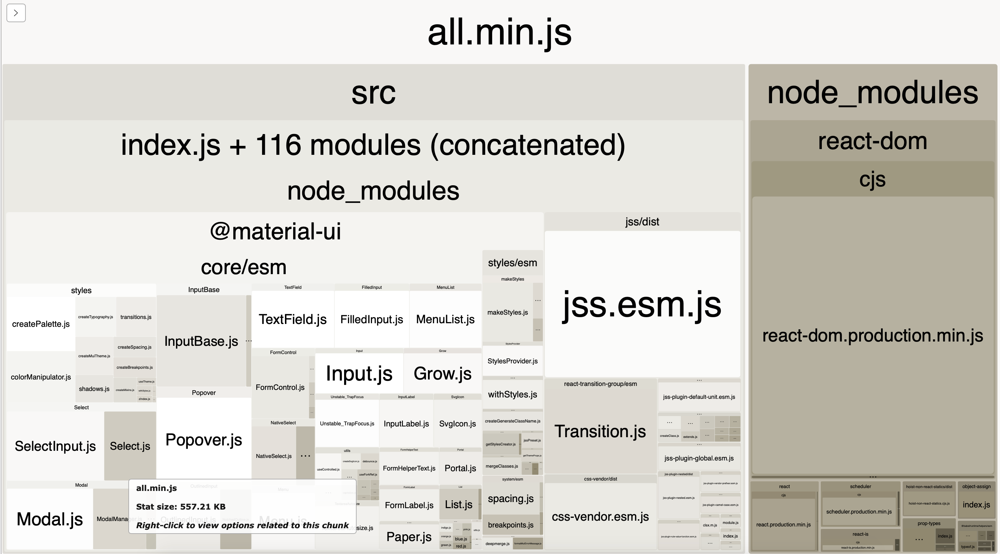

Minimum example of React Material-UI with the only TextField component imported - result bundle size is 250Kb!

webpack-bundle-analyzer shows everything is imported, nothing is tree shaked:



How to reproduce:
```
npm install
npm run build
npm run analyze
```

- Webpack 4.43
- Material-UI 4.11

https://material-ui.com 
